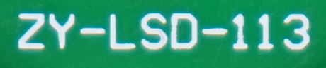

# pcbTest – Guía de uso

> 🌐 Otros idiomas: [Euskera](ERABILTZAILE_GIDA.md) | [English](USER_GUIDE.md)

*GPL-3.0-or-later / CC-BY-SA-4.0*

---

## Propósito

Inspección visual de placas PCB mediante cámara, utilizando homografía para corregir la imagen, detectando componentes con YOLO y comparándolos con una placa de referencia.

**Pipeline:**
```
Cámara → homografía → orientación → YOLO → comparación → OK / MAL
```

**Licencia:** Código: GPL-3.0-or-later. Documentación y materiales: CC-BY-SA-4.0.

---

## Índice

1. [Qué hace pcbTest](#1-qué-hace-pcbtest)
2. [Estructura del proyecto](#2-estructura-del-proyecto)
3. [Primer arranque](#3-primer-arranque)
4. [Pestaña Rutas](#4-pestaña-rutas)
5. [Pestaña Cámara](#5-pestaña-cámara)
6. [Configuración de la inspección](#6-configuración-de-la-inspección)
7. [Realizar una inspección](#7-realizar-una-inspección)
8. [Interpretar los resultados](#8-interpretar-los-resultados)
9. [Ajustes recomendados](#9-ajustes-recomendados)
10. [Problemas frecuentes](#10-problemas-frecuentes)
11. [Licencia y notas de uso](#11-licencia-y-notas-de-uso)

---

## 1. Qué hace pcbTest

pcbTest es una herramienta para analizar el estado de una placa PCB. Una cámara captura la imagen de la placa, el programa corrige la perspectiva, detecta los componentes y los compara con una placa de referencia correcta. Al final, informa al usuario si la placa está **OK** o **MAL**.

El programa no se limita a ejecutar inferencia YOLO. Antes prepara la imagen, coloca la placa en un plano plano y trata de corregir su orientación. Por eso es importante entender el pipeline completo.

```
Cámara
  → capturar imagen
  → detectar placa
  → aplicar homografía
  → verificar orientación mediante serigrafía
  → detectar componentes con YOLO
  → comparar con referenceBoard/
  → resultado: PLACA OK o PLACA MAL
```

> **Importante:** pcbTest está pensado para uso educativo y de prototipado. Antes de emplearlo en un entorno industrial, deben validarse adecuadamente la iluminación, la cámara, el modelo, las tolerancias y los falsos positivos/negativos.

---

## 2. Estructura del proyecto

Al copiar el programa a otro Jetson, se recomienda una carpeta ordenada:

```
pcbTest/
├── pcb_gui_inspeccion.py
├── pcb_gui_inspeccion.sh
├── pcb_realtime_pipeline.py
├── pcb_realtime_pipeline.sh
├── pcb_camera_test.py
├── pcb_camera_test.sh
├── procesar_pcb_homografia_yolo.py
├── comparar_yolo_reference.py
├── config_homografia.json
├── keypoints/
│   └── serigrafia.png
├── referenceBoard/
│   ├── notes.json
│   └── labels/
│       └── referencia.txt
├── weights/
│   └── best.pt
├── results/
│   └── .gitkeep
├── README.md
├── install_notes.md
└── .gitignore
```

**Ficheros importantes:**

| Fichero | Descripción |
|---------|-------------|
| `pcb_gui_inspeccion.py` | Interfaz gráfica principal. |
| `pcb_realtime_pipeline.py` | Pipeline completo de inspección. |
| `pcb_camera_test.py` | Script para probar la cámara rápidamente. |
| `procesar_pcb_homografia_yolo.py` | Homografía, orientación y procesado de imagen. |
| `comparar_yolo_reference.py` | Compara las detecciones YOLO con la referencia. |
| `config_homografia.json` | Define el tamaño de la imagen corregida. |
| `referenceBoard/` | Referencia geométrica y nombres de clases de la placa correcta. |
| `weights/best.pt` | Modelo YOLO. |

---

## 3. Primer arranque

Antes de iniciar el programa, asegúrese de que el Jetson tiene permiso para usar Docker y de que la cámara aparece en el sistema.

**Permisos:**

```bash
cd pcbTest
chmod +x pcb_gui_inspeccion.py
chmod +x pcb_gui_inspeccion.sh
chmod +x pcb_realtime_pipeline.py
chmod +x pcb_realtime_pipeline.sh
chmod +x pcb_camera_test.py
chmod +x pcb_camera_test.sh
```

**Lanzar la GUI:**

```bash
cd pcbTest
./pcb_gui_inspeccion.sh
```

Al abrir la interfaz verá cuatro pestañas principales: **Inspección**, **Rutas**, **Cámara** y **Configuración de inspección**. Su funcionamiento se explica en las secciones siguientes.

> **Nota:** El fichero `gui_config.json` **no** debe copiarse a otra máquina. Almacena rutas absolutas específicas de cada equipo.

---

## 4. Pestaña Rutas

En esta pestaña se verifican o seleccionan las rutas que necesita el programa. La primera vez que se use, este es el primer apartado que hay que configurar.

| Campo | Descripción |
|-------|-------------|
| **Modelo YOLO** | El modelo YOLO. Recomendado: `weights/best.pt`. Si está en otra ubicación, seleccione la ruta absoluta. |
| **Carpeta de salida** | Carpeta donde se guardarán los resultados. Habitual: `results/gui_pcb_inspection/`. |
| **referenceBoard** | Carpeta que contiene la referencia de la placa correcta. |
| **config_homografia.json** | Define el ancho y alto de la imagen corregida. |
| **Serigrafía orientación** | Imagen de serigrafía usada para determinar la orientación. |

Ejemplo de imagen de serigrafía (`keypoints/serigrafia.png`):



### config_homografia.json

Este fichero **no** detecta la placa. Define el tamaño de la imagen que se generará tras la homografía. Contenido mínimo:

```json
{
  "out_width": 1355,
  "out_height": 774
}
```

> **Atención:** Si se cambia este tamaño, las coordenadas de `referenceBoard/labels/referencia.txt` están vinculadas a las dimensiones de la imagen corregida.

### Carpeta referenceBoard

```
referenceBoard/
├── notes.json
└── labels/
    └── referencia.txt
```

- `notes.json` – contiene los nombres de las clases.
- `labels/referencia.txt` – contiene las posiciones de los componentes de la placa correcta en formato YOLO.
- Debe haber **exactamente un** fichero `.txt` dentro de `labels/`.

---

## 5. Pestaña Cámara

En la pestaña Cámara se selecciona la fuente de la cámara y se puede realizar una prueba de captura. Se recomienda hacerlo antes de iniciar una inspección completa.

**Fuentes habituales:**

```
0
1
/dev/video0
/dev/video1
/dev/video2
```

Para saber en qué dispositivo está la cámara, ejecute en una terminal:

```bash
ls -l /dev/video*
v4l2-ctl --list-devices
```

**Botón TEST cámara**

El botón *TEST cámara* realiza una captura instantánea y muestra la imagen en la misma pestaña. Si la captura es correcta, ya está listo para una inspección completa.

La imagen de prueba se guarda en:

```
results/gui_pcb_inspection/camera_test/latest_camera_test.jpg
```

Ejemplo de imagen de prueba de cámara:


**Resolución**

Si *Ancho cámara* y *Alto cámara* se dejan en `0`, OpenCV utilizará la resolución predeterminada de la cámara. Si hay problemas, pruebe:

- `1280 × 720`
- `1920 × 1080`

> **Importante:** Si la prueba de cámara falla, **no** inicie la inspección. Compruebe primero la fuente de cámara, los permisos de Docker y los dispositivos `/dev/video*`.

---

## 6. Configuración de la inspección

En esta pestaña se ajustan los parámetros de detección y comparación. Estos valores afectan directamente a los resultados **MISSING**, **MISPLACED** y **EXTRA**.

| Parámetro | Descripción |
|-----------|-------------|
| **Método** | Método de homografía. Recomendado: `hough`. |
| **Confianza YOLO** | Confianza mínima para aceptar una detección. Valores más altos dan menos falsos positivos. |
| **Distancia centro** | Distancia máxima entre los centros de la referencia y la detección. |
| **Distancia relajada** | Tolerancia más amplia usada para no descartar candidatos en algunos casos. |
| **EXTRA como fallo** | Si está activado, cualquier componente extra marcará la placa como MAL. |
| **Límite captura** | Normalmente `1` para uso con botón. |

**Valores iniciales recomendados:**

| Parámetro | Valor |
|-----------|-------|
| Método | `hough` |
| Confianza YOLO | `0.49` |
| Distancia centro máx. | `0.035` |
| Distancia centro relajada | `0.060` |
| Límite captura | `1` |
| Duración | `0` |
| Intervalo | `0` |
| EXTRA como fallo | desactivado |

> Cambie **un solo parámetro a la vez**. Si hay un problema, modifique un único valor y vuelva a probar para identificar qué ha mejorado o empeorado el resultado.

---

## 7. Realizar una inspección

Antes de ejecutar una inspección, verifique que la cámara ve correctamente y que la placa completa es visible. La placa **no debe tocar** los bordes de la imagen.

**Procedimiento recomendado:**

1. Abra la GUI: `./pcb_gui_inspeccion.sh`
2. Vaya a la pestaña **Rutas** y verifique todos los ficheros.
3. Vaya a la pestaña **Cámara** y pulse **TEST cámara**.
4. Si la captura es correcta, vaya a la pestaña **Inspección**.
5. Coloque la placa bajo la cámara, completamente visible y bien iluminada.
6. Pulse **Analizar placa**.
7. Espere el resultado: **PLACA OK** o **PLACA MAL**.

**Qué ocurre internamente:**

1. Se realiza la captura de cámara.
2. Se detecta la placa.
3. Se aplica la homografía.
4. Se verifica la orientación mediante la serigrafía.
5. Se ejecuta la inferencia YOLO.
6. Se comparan las detecciones con la referencia.
7. Se generan imagen, CSVs y resumen.

---

## 8. Interpretar los resultados

Tras la inspección, el programa genera una imagen y varios ficheros CSV. La GUI normalmente muestra `latest_failures.jpg`, la imagen que resalta los fallos detectados.

Ejemplo de imagen con fallos resaltados (`overlay_failures/latest_failures.jpg`):


Ejemplo de imagen corregida tras la homografía (`corrected/latest_corrected.jpg`):


| Estado | Significado |
|--------|-------------|
| **OK** | El componente de referencia se encontró y su posición es aceptable. |
| **MISSING** | Un componente esperado en la referencia no fue detectado de forma válida. |
| **MISPLACED** | Se detectó un componente de la clase correcta, pero su posición o geometría no es suficientemente buena. |
| **EXTRA** | YOLO realizó una detección que no tiene componente equivalente en la referencia. |

**Criterio OK / MAL (por defecto):**

La GUI considera que la placa es correcta si:

- `MISSING = 0`
- `MISPLACED = 0`

Las detecciones EXTRA se tratan por defecto como avisos. Si se activa **EXTRA como fallo** en la configuración, incluso un único EXTRA marcará la placa como MAL.

**Carpeta de resultados:**

```
results/gui_pcb_inspection/
├── raw/latest_raw.jpg
├── corrected/latest_corrected.jpg
├── overlay/latest_result.jpg
├── overlay_failures/latest_failures.jpg
├── components/latest_components.csv
├── comparison/latest_comparison.csv
├── camera_test/latest_camera_test.jpg
├── debug/
└── summary_realtime.csv
```

---

## 9. Ajustes recomendados

**Demasiados falsos positivos**

Aumente la confianza YOLO. Esto descartará detecciones débiles.

```
0.49 → 0.55 → 0.60
```

**Componentes correctos aparecen como MISPLACED**

Aumente ligeramente la distancia de centro. Esto amplía la tolerancia geométrica.

```
0.035 → 0.045 → 0.060
```

**Componentes reales aparecen como MISSING**

Disminuya ligeramente la confianza YOLO o revise la iluminación y el enfoque.

```
0.60 → 0.55 → 0.49
```

**Homografía incorrecta**

- Asegúrese de que la placa completa sea visible en la imagen.
- Evite reflejos fuertes y sombras grandes.
- La placa no debe tocar los bordes de la imagen.
- Revise las imágenes de la carpeta `debug/homography/`.
- Mantenga el método `hough`; habitualmente es el más robusto cuando los bordes son visibles.

Ejemplo de imagen de depuración de homografía:


**Orientación incorrecta**

- Verifique que `keypoints/serigrafia.png` es correcto.
- La serigrafía debe ser siempre visible.
- No use una serigrafía muy pequeña o con mucho brillo.
- Revise las imágenes de la carpeta `debug/orientation/`.

Ejemplo de imagen de depuración de orientación:


---

## 10. Problemas frecuentes

**Error: no se puede abrir la cámara**

Compruebe primero que el sistema ve la cámara:

```bash
ls -l /dev/video*
v4l2-ctl --list-devices
```

En la GUI, pruebe otras fuentes: `0`, `1`, `/dev/video0`, `/dev/video1`, `/dev/video2`.

**Docker da un error de permisos**

El usuario debe pertenecer al grupo `docker`:

```bash
sudo usermod -aG docker $USER
```

Luego cierre sesión y vuelva a abrirla.

**Los ficheros se crean como root**

Los nuevos scripts ejecutan Docker como usuario normal. Sin embargo, si hay carpetas creadas previamente como root:

```bash
sudo chown -R $USER:$USER results .ultralytics .config .cache
```

**Mensaje `no_valid_candidate_same_class`**

Este mensaje significa que el programa encontró detecciones de la misma clase pero no pudo hallar ningún candidato válido para emparejar con un componente de referencia concreto. Normalmente está relacionado con la distancia de centro, el solapamiento, el tamaño o la homografía.

---

## 11. Licencia y notas de uso

El código fuente de pcbTest se distribuye bajo:

> **GNU General Public License v3.0 or later**
> `SPDX-License-Identifier: GPL-3.0-or-later`

Esto significa que el programa puede usarse, estudiarse, modificarse y redistribuirse, pero las versiones modificadas distribuidas deben mantener la licencia GPLv3 o una compatible.

La documentación, las imágenes y los materiales explicativos se distribuyen bajo:

> **Creative Commons Attribution-ShareAlike 4.0 International**
> `SPDX-License-Identifier: CC-BY-SA-4.0`

**Notas de uso críticas:**

- Este programa está pensado para uso educativo y de prototipado.
- Antes de emplearlo en un entorno industrial, se requiere una validación exhaustiva.
- Los resultados del modelo YOLO dependen de la calidad de los datos de entrenamiento.
- La cámara, la iluminación y el posicionamiento de la placa deben ser repetibles.
- Al compartir `best.pt`, tenga en cuenta el origen y la licencia de los datos de entrenamiento.

---

*Resumen para un uso correcto: primero pruebe la cámara, luego revise las imágenes de depuración de homografía y orientación, y por último ajuste gradualmente los parámetros de YOLO y comparación.*
